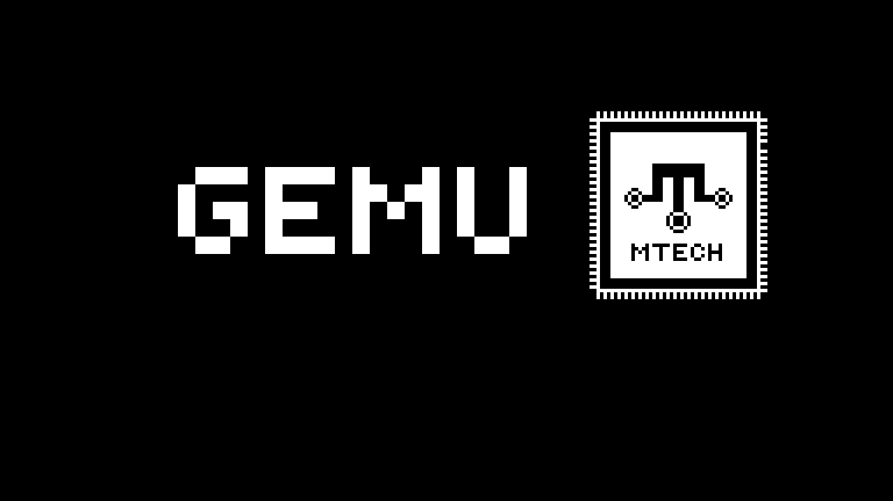
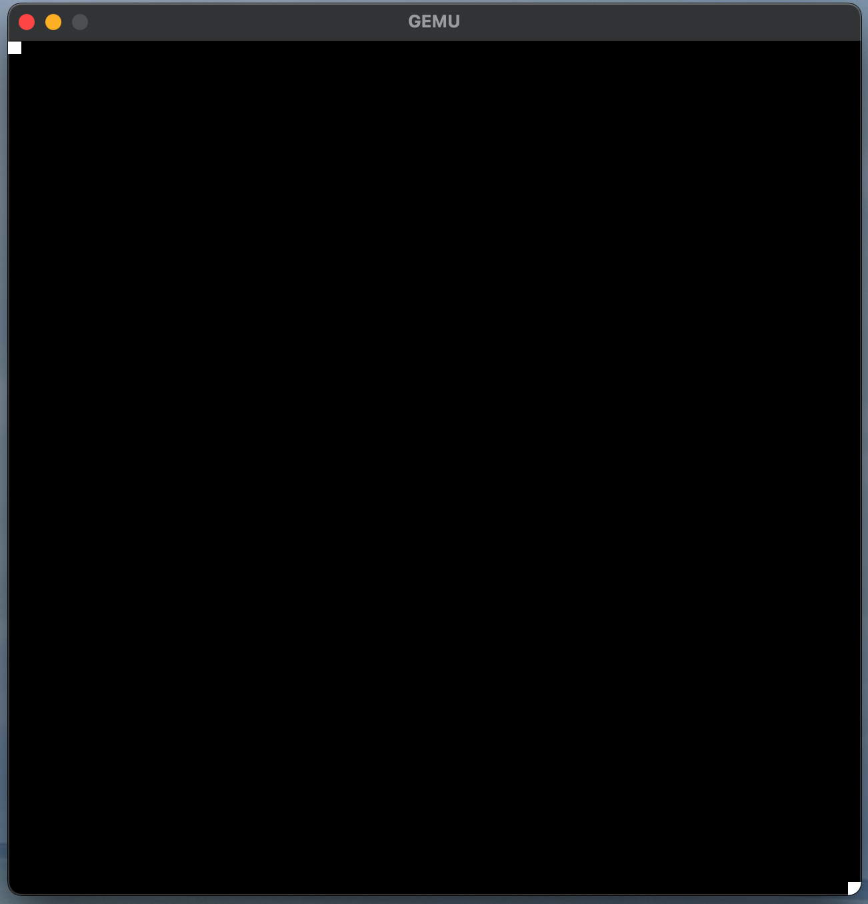
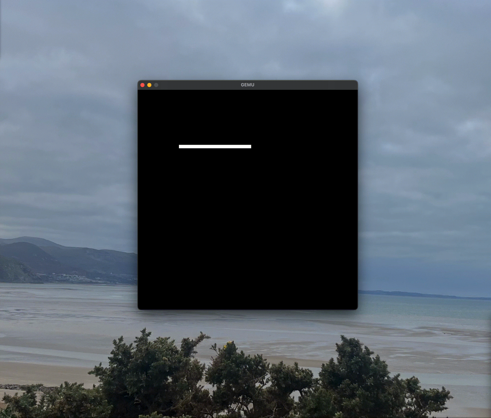

# GEMU

GEMU is an emulator for a custom designed CPU - the Gravy 16, also complete with a mini language to produce programs for it!
I made it to learn and improve my c++ skills as I was quite new to the language while writing it. I also made it to learn and understand key concepts of low level computing. 

The Gravy 16 has a 16bit address bus and 16bit registers, but only an 8bit data bus, so ROM and RAM are byte wide. The CPU stitches two bytes together to build each instruction it fetches.

# Features
- Read binary/hexadecimal values from a .txt file and store in ROM, one byte per line
- Fetch-decode-execute cycle over byte wide memory
- Custom ISA
- Mini programming language based on assembly
- Graphics using a framebuffer and raylib window

# How To Use 
## Prerequisites
Before using GEMU, ensure that Raylib is installed and correctly configured on your system.

### 1. Write a Program in GASM
Create your program in **GASM (Gravy Assembly)** and save it with the `.gasm` extension.
Example: example.gasm
For information about the GASM language and instruction set, see: GEMU_docs.md

Store all source files in the `programs/` directory.

### 2. Assemble the Program

Run the assembler: python GASM/compiler.py

When prompted:
* Enter the name of your source file (e.g. `example.gasm`)
* Enter a name for the output ROM

The compiled ROM will be saved in the `roms/` directory. The ROM is a byte stream, so
each line holds one byte in hexadecimal, and instructions and immediates are each split
across a high byte and a low byte.

### 3. Build GEMU

Compile: src/GEMU.cpp
using your preferred C++ compiler and Raylib installation.

### 4. Launch GEMU

Run the emulator executable.
When prompted, enter the path to the ROM you wish to load.

Example: roms/dot.txt

### 5. Select Verbose Mode (Optional)

When GEMU starts, you can enable verbose mode.
Verbose mode displays information about each instruction as it is executed, including the current cycle, instruction name, and accumulator value.

# Example Programs
### Dots (Graphics demo)

### Cube (Graphics Demo)

This has been purposely slowed down. The emulator is much faster

